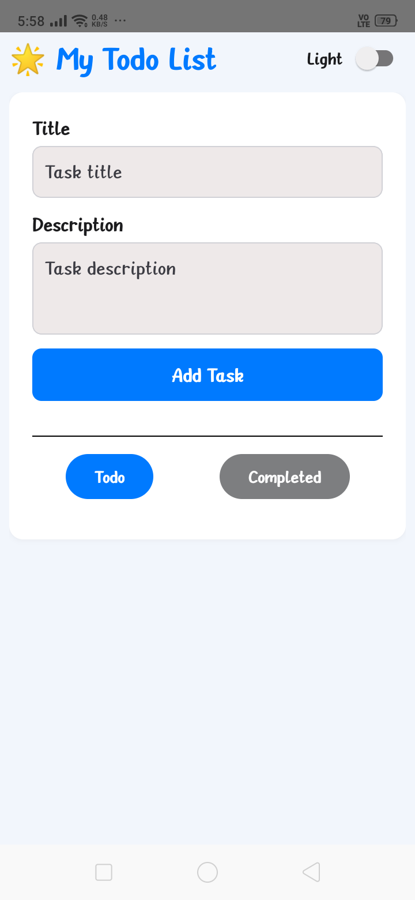
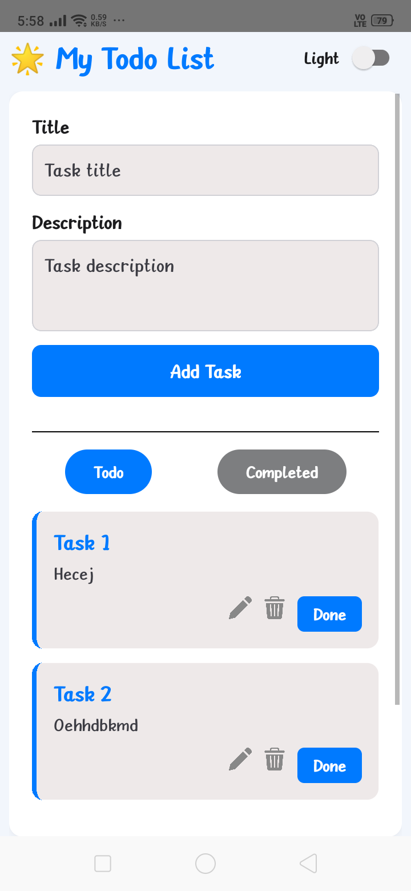
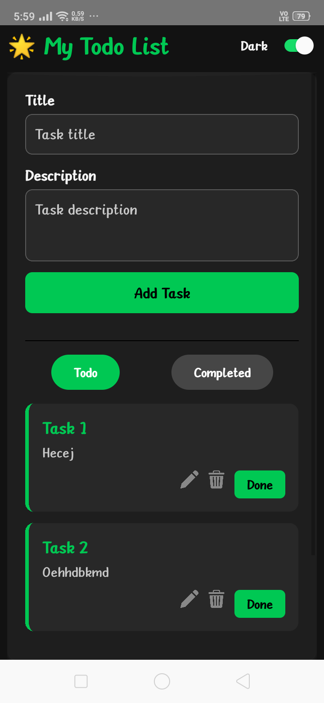
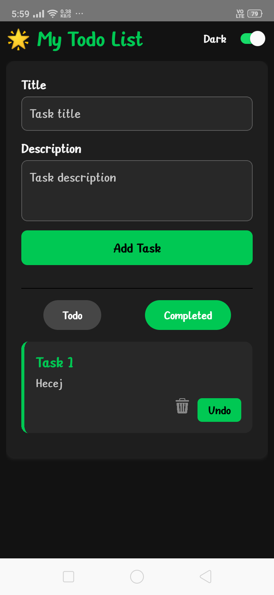

# 🌟 My Todo List - React Native CLI App

A beautifully themed **React Native CLI** Todo App with support for **dark/light mode**, task management with editing, and persistent storage using **AsyncStorage**.

<p align="center">
  
  
  
  
</p>

---

## ✨ Features

- 🔄 Add, edit, delete tasks
- ✅ Mark tasks as "Done" or "Undo"
- 🌓 Toggle between **Light** and **Dark** themes
- 📁 Persistent storage using `AsyncStorage`
- 🧭 Easy switch between Todo and Completed tasks
- 📱 Mobile responsive & clean UI

---

## 🛠️ How to Run


1. **Clone the repo**
   ```bash
   git clone https://github.com/AbhaySharma3666/Todo-App.git

2. **Install dependencies**
   ```terminal
   npm install
   
3. **Run on Android**
   ```
   npx react-native run-android
---

## 📦 External Dependencies Used

| Dependency                                                                                                            | Purpose                                 |
| --------------------------------------------------------------------------------------------------------------------- | --------------------------------------- |
| [react-native](https://reactnative.dev/)                                                                              | Core framework for building native apps |
| [@react-native-async-storage/async-storage](https://react-native-async-storage.github.io/async-storage/docs/install/) | Persisting tasks locally                |
---
## 🔗 Useful Links
- [React Native CLI Documentation](https://reactnative.dev/docs/environment-setup)
- [AsyncStorage Docs](https://react-native-async-storage.github.io/async-storage/docs/usage/)
- [Lucide– For edit and delete icons](https://lucide.dev/)
- [React Native StyleSheet Docs](https://reactnative.dev/docs/stylesheet)

---
## 🎨 Features
- ✅ Add new tasks
- ✅ Edit tasks in a modal
- ✅ Delete tasks with confirmation alert
- ✅ Mark tasks as done / undone
- ✅ Switch between Light and Dark mode
- ✅ AsyncStorage integration for saving tasks
- ✅ Tabbed view: Todo and Completed

--- 
## 💡 Notes

- This project uses React Native CLI, not Expo.
- Tested on Android — for iOS, make sure you have Xcode configured.
- Images for icons should be placed in the ./images folder and imported accordingly.

---

## 🧑‍💻 Developed By
**Abhay Sharma**
[GitHub Profile](https://github.com/AbhaySharma3666/Todo-App.git)
